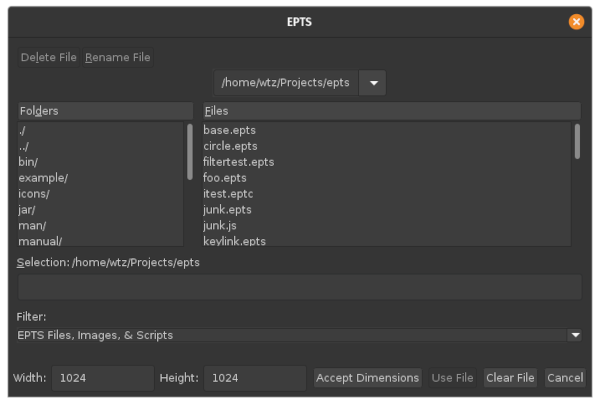
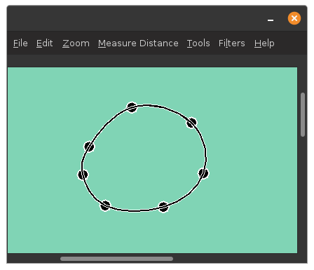
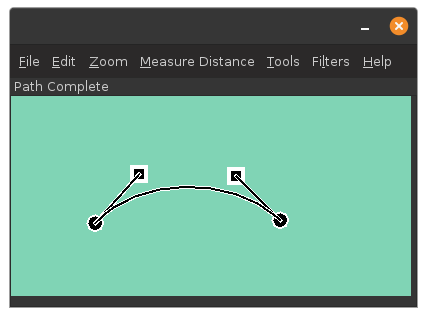
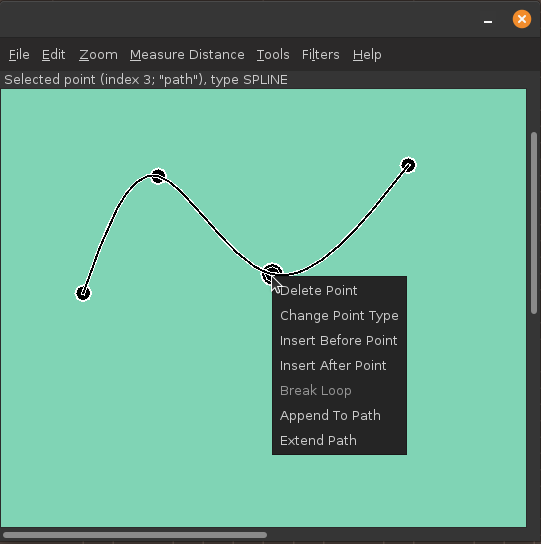
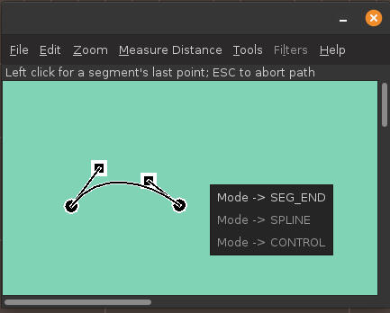
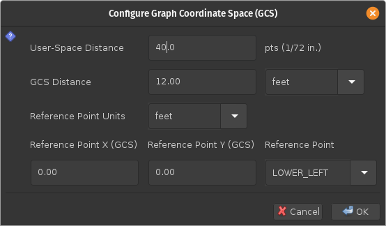
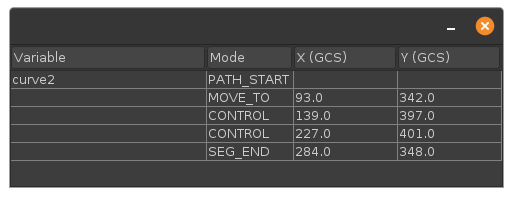
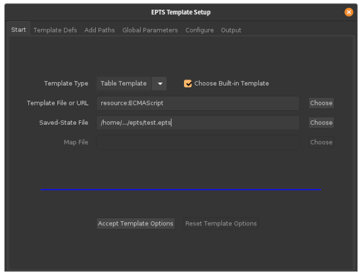
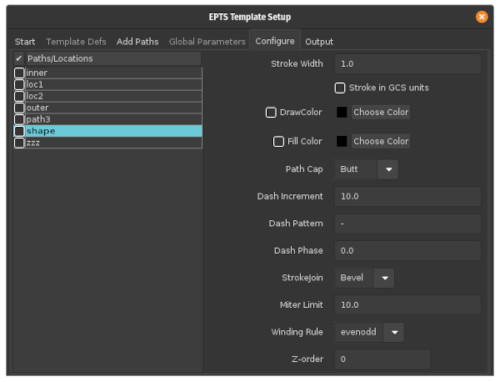

# EPTS

EPTS is a vector-graphics editor that can

  - optionally display a background image while editing paths
    and points, making it easy to trace existing shapes or
    align a series of paths or points with an image.

  - measure distances.

  - create and edit paths and points, with paths consisting of
    a series of segment end points, intermediate control points,
    and spline points (the knots of a cubic spline).

  - assign various attributes (e.g., winding rules and colors) to
    paths and composite paths.

  - print paths in a variety of text formats using built-in and
    user-defined templates.  The built-in templates allow one to
    create SVG files and scripting-language files that can be
    used in build environments.

EPTS uses two coordinate systems:

  - user space.  User space is the standard Java user space where
    a unit of 1.0 corresponds to one point (1/72 inches).

  - GCS (Graph Coordinate Space). GCS is a user-defined coordinate
    system.  One can configure a scaling factor between user space and
    GCS.  For example, one can measure the user-space distance between
    two points on an image, and use a dialog box to specify the
    corresponding distance in GCS in a variety of units (although for
    physical distances, GCS will use meters).

Users may find EPTS easier to use than more capable graphics editors
such as Inkscape, mainly because EPTS has far fewer options: with a
"full featured" program, options can be hard to find in a sea of menu
items and various controls.  Because EPTS can generate SVG, it
is easy to create a series of paths using EPTS and then use Inkscape
for additional graphics operations.

## Documentation

While there is an on-line manual, and EPTS provides an embedded web
server that allows this manual to be shared, there is also a
[github version](manual/index.html) of the manual.

## Installation

To install, visit the
[Debian Repository](https://billzaumen.github.io/bzdev/) page and
follow the instructions for setting up /etc/apt to access that
repository, and install libbzdev-java, which requires
libbzdev-base-java, libbzdev-ejws-java, libbzdev-esp-java,
libbzdev-math-java, libbzdev-obnaming-java, libbzdev-graphics-java,
libbzdev-desktop-java, libbzdev-devqsim-java, and
libbzdev-anim2d-java.  For non-Debian Linux systems, there is a
[direct links](https://billzaumen.github.io/bzdev/packages.html) page
for downloading Debian packages, which the program `alien` can convert
into other package formats such as RPM.  For other systems, visit the
[installers](https://billzaumen.github.io/bzdev/installers.html) page
and use the `bzdev` and `epts` links to download installers (each is a
JAR file). Then follow the instructions on that page for running an
installer.

## Screenshots

Starting EPTS:

The main window, displaying a path that forms a closed loop:

A path with explicit control points:

Editing a point along a path:

Changing the type of a point on a path:

Configuration graph coordinate space:

The point/path table:

Configuring template processing:

Setting attributes used by a template:

